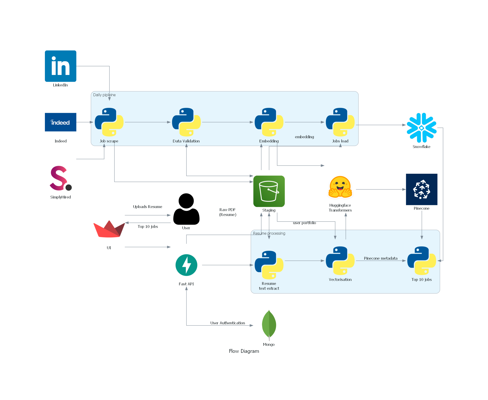

# Job Match - Redefining your Career Path

## Overview

JobMatch is a revolutionary Job Recommendation System designed to streamline and enhance the job search experience by centralizing the job search process and by analyzing user uploaded resumes. JobMatch provides tailored job recommendations from top platforms like LinkedIn and Indeed. Users gain direct access to recommended job listings, ensuring a personalized and efficient job search experience.

## Architecture:

## Codelab
Link: https://codelabs-preview.appspot.com/?file_id=1xOJo6D40dsWjctPaj2Z7uZlOG9cHrW0DRejiGDkK9XM#0

## Team Information and Contribution

| Name                      | Contribution % |
| ------------------------- | -------------- |
| Muskan Deepak Raisinghani | 33.3%          |
| Rachana Keshav            | 33.3%          |
| Ritesh Choudhary          | 33.3%          |